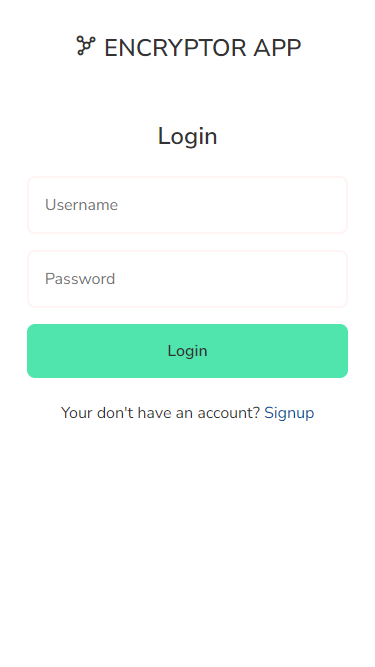
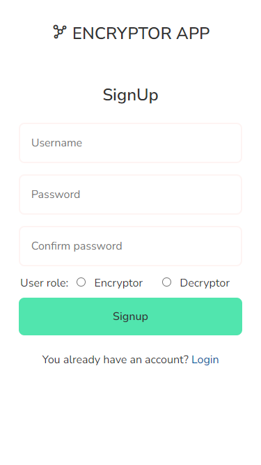
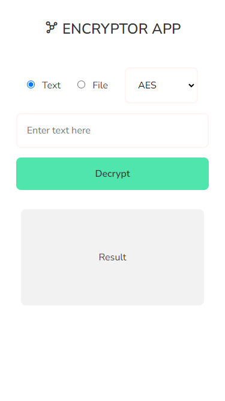

# Encryptor app

Encryptor app is a Progressive Web Application to encrypt and decrypt both text and files.

You can find the backend [here](https://github.com/chars-mc/encryptor-api).

## Screenshots





## Technologies


---

## Get started

Install the dependencies...

```bash
npm install
```

...then start [Rollup](https://rollupjs.org):

```bash
npm run dev
```

Navigate to [localhost:5000](http://localhost:5000). You should see your app running. Edit a component file in `src`, save it, and reload the page to see your changes.

## Building and running in production mode

To create an optimised version of the app:

```bash
npm run build
```
